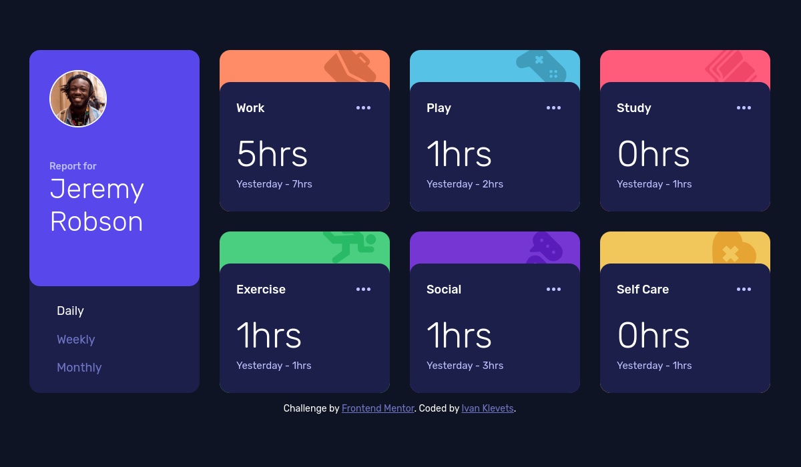

# Frontend Mentor - Time tracking dashboard solution

This is a solution to the [Time tracking dashboard challenge on Frontend Mentor](https://www.frontendmentor.io/challenges/time-tracking-dashboard-UIQ7167Jw). Frontend Mentor challenges help you improve your coding skills by building realistic projects. 

## Table of contents

- [Overview](#overview)
  - [The challenge](#the-challenge)
  - [Screenshot](#screenshot)
  - [Links](#links)
- [My process](#my-process)
  - [Built with](#built-with)
  - [What I learned](#what-i-learned)
  - [Continued development](#continued-development)
- [Author](#author)
- [Acknowledgments](#acknowledgments)

**Note: Delete this note and update the table of contents based on what sections you keep.**

## Overview

### The challenge

Users should be able to:

- View the optimal layout for the site depending on their device's screen size
- See hover states for all interactive elements on the page
- Switch between viewing Daily, Weekly, and Monthly stats

### Screenshot



### Links

- Solution URL: [solution at GitHub](https://github.com/LMN-tal/fm-time-tracking-dashboard-main)
- Live Site URL: [live site at GitHub Pages](https://lmn-tal.github.io/fm-time-tracking-dashboard-main/)

## My process

### Built with

- CSS custom properties
- Flexbox
- CSS Grid
- Mobile-first workflow

### What I learned

To highlight an element it is convenient to use either ``box-shadow: inset ...`` or ``filter: brightness()``
```css
.card__container:hover {  
  box-shadow: inset 0 0 100px 100px rgba(120, 120, 255, 0.28);
}
...
.card__more:hover {
  filter: brightness(180%) saturate(85%);
}
```

Local ``data.json`` can be loaded using ``fetch()`` function
```js
let data = [];

async function getData() {
  let url = 'data.json';
  const data = await (await fetch(url)).json();
  return data;
}

async function generateContent(period = 'daily') {
  if (!data.length) data = await getData();
  ...
}
```

### Continued development

In future projects I'd like to learn how to use JS libraries and frameworks instead of vanilla JS.

## Author

- Website - [Ivan Klevets](https://github.com/LMN-tal)
- My Frontend Mentor profile - [@LMN-tal](https://www.frontendmentor.io/profile/LMN-tal)

## Acknowledgments

Many thanks to creators of [Frontend Mentor](https://www.frontendmentor.io/). I love their idea of building community of web developers who help each other to master frontend technologies.
